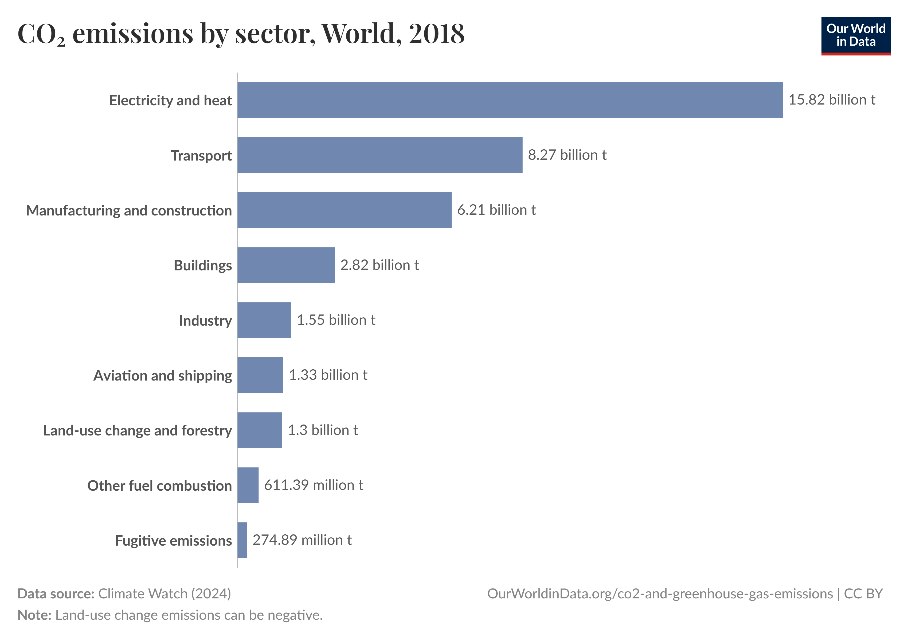
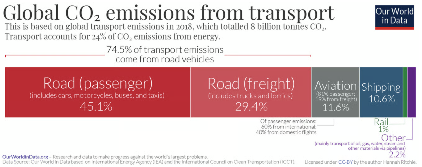
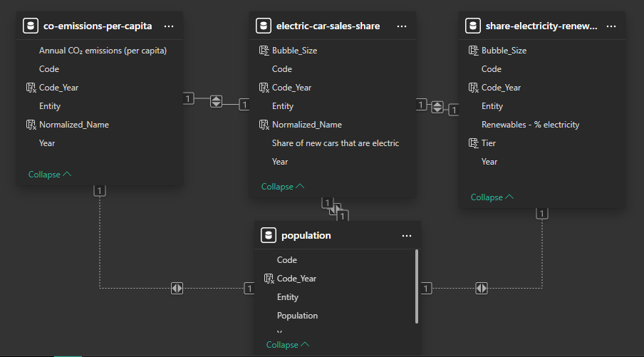
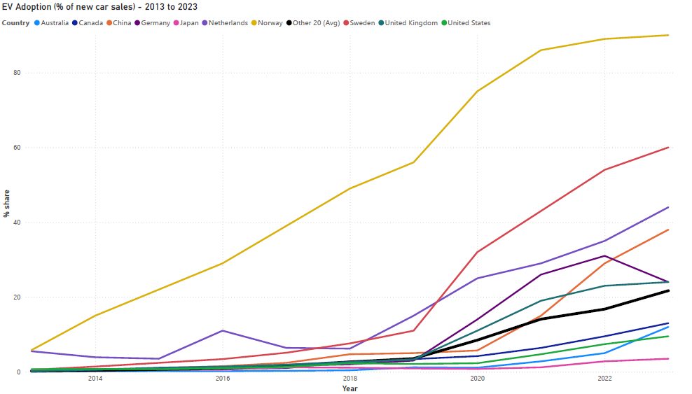
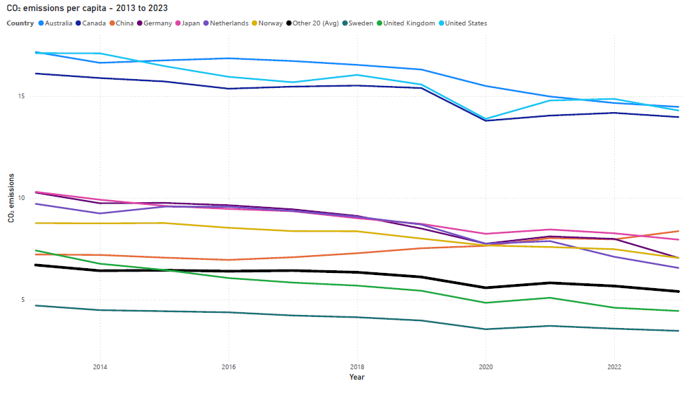
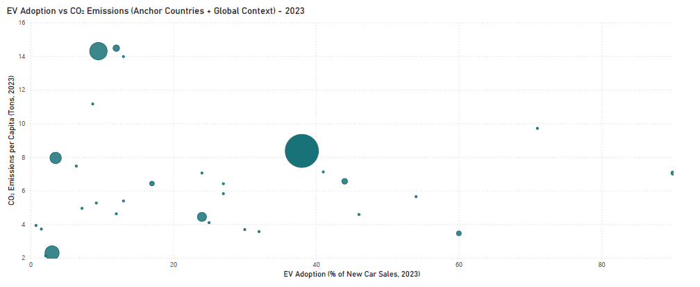
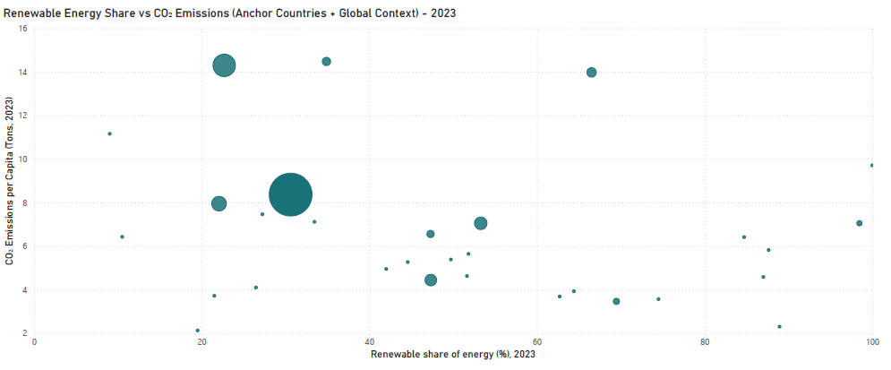
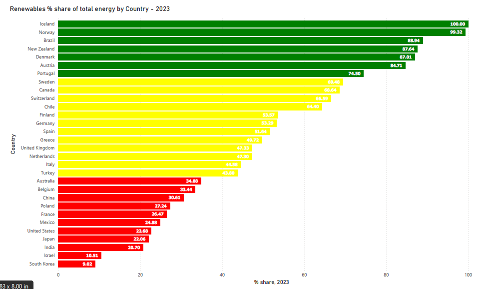
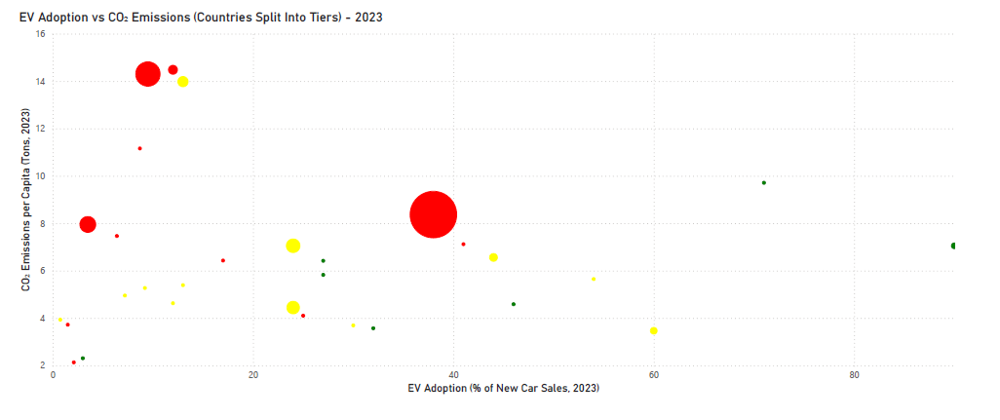

# EV Adoption vs CO₂ Emissions: A Global Dashboard

*Testing whether EV adoption really delivers on its climate promise.*

---

## Executive Summary

Governments are betting billions on electric vehicles as a climate solution. But are EVs truly lowering emissions at scale?  

This dashboard shows that **EV adoption alone doesn’t guarantee lower CO₂ emissions**. Countries with clean electricity grids (e.g., Norway, Sweden) achieve major reductions, while fossil-heavy grids (e.g., China, US, Australia) cancel out much of the benefit.  

The conclusion is clear: **EVs only deliver on their promise when paired with clean energy grids.**

---

## Problem Statement

Emissions from internal combustion engines (ICEs) are a major driver of climate change.

> Source: Our World in Data – *Emissions by Sector*

Transport accounts for around one-fifth of global CO₂ emissions. Three-quarters of this is from road transport.

> Source: Our World in Data - *Cars, planes, trains: where do CO₂ emissions from transport come from?*

This means that ICEs alone are responsible for close to one-fifth of all CO₂ emissions worldwide.

Electric vehicles are often promoted as a solution to climate change, but do they actually reduce emissions at scale?

I set out to explore whether countries with higher EV adoption also achieve lower carbon emissions per capita, and what role renewable energy plays in shaping the outcome.

---

## Methodology

Data sources included:

- EV sales share by country (2013–2023)  
- CO₂ emissions per capita (2013–2023)  
- Population data (2023)  
- Share of electricity generated by renewables (2013–2023)  

### Decluttering Steps

The project combines four datasets. To keep the analysis clear:

- **Step 1:** I focused on **10 Anchor countries** (Australia, Canada, China, Germany, Japan, Netherlands, Norway, Sweden, United Kingdom, United States) while grouping the **Other 20** as background context.

- **Step 2:** I refined scatter plot visuals so anchors scale with **true population**, while the Other 20 appear as smaller dots. This way, all 30 countries stay visible, but anchors drive the narrative.  

### Renewable Energy Tiering

I classified countries into three tiers based on renewable energy share:  

- **Tier 1 (70–100%)** – Clean grids i.e. high renewables  
- **Tier 2 (40–70%)** – Mixed grids  
- **Tier 3 (<40%)** – Fossil-heavy grids  

This tiering provides a simple, transparent way to compare EV adoption against emissions outcomes across grids with very different levels of renewable penetration.

---

## Tools & Skills

- **Tools:** Power BI, Excel, ChatGPT (as research/narrative accelerator)  
- **Skills:** Data cleaning, dataset merging, correlation analysis, dashboard design, and data storytelling  

I conceptualized and executed this project, with ChatGPT used as a **research assistant** for brainstorming, to accelerate dataset discovery and refine narrative clarity. All analysis, design choices, and conclusions are my own.

---

## Results & Key Insights

### 1. EV Adoption Trends

*Punchline: EV adoption is accelerating worldwide.*  
EV sales share has steadily risen since 2013, led by Norway (90% in 2023).  

---

### 2. CO₂ Emissions Trends  

*Punchline: Emissions are falling, but unevenly.*  
CO₂ per capita has generally decreased, with Sweden among the lowest at 3.46 tonnes/person in 2023.  

---

### 3. EV Adoption vs CO₂ (Initial Scatter)  

*Punchline: The relationship between EV adoption and CO₂ emissions is unclear.*  
I charted EV adoption vs CO₂ emissions per capita to try to find a correlation between the two.

Three of the anchors (Australia, Canada, United States) clustered at the top left, corresponding to low EV adoption/high CO₂ emissions.  There are also a few dots, including 2 of the anchors (Norway and Sweden) on the bottom right, corresponding to high EV adoption/low CO₂ emissions.  Given the premise that higher EV adoption leads to lower CO₂ emissions, these findings are expected.

It is a bit surprising to find a cluster of dots at the lower left (low EV adoption/low CO₂ emissions), Iceland close to the upper right (high EV adoption/high CO₂ emissions) and China right in the middle.  Even with relatively high EV adoption, its CO₂ emissions are still above average.

Overall, the chart looks messy and difficult to explain.  There doesn't seem to be a clear correlation between EV adoption and CO₂ emissions.  EV adoption trends aren’t enough to explain the picture.

To really understand emissions, there seems to be a missing piece — *and I think it is the energy grid*.

---

### 4. Renewables vs CO₂

*Punchline: Renewables reveal a pattern.*  

I charted the renewable energy share of the total energy produced vs. CO₂ emissions, in the same 30 countries as above.

Most countries gravitate toward the lower-right (high renewable share, low CO₂). This suggest that greater renewable energy adoption generally leads to lower emissions.  

---

### 5. Renewable Energy Tiers

*Punchline: Countries fall cleanly into three groups.*
Countries can be grouped into three tiers based on renewable energy share: Tier 1 (70–100%) = clean grids, Tier 2 (40–70%) = mixed grids, and Tier 3 (<40%) = fossil-heavy grids.

This tiering system helps to compare EV adoption and CO₂ emissions on a more level playing field.

---

### 6. EV Adoption vs CO₂ (Tiered Scatter)  

*Punchline: The messy chart finally makes sense.*  
After I integrated the tiers to the initial scatter plot, the chart finally made sense.

- **Tier 1 (green):** High EV adoption leads to low emissions  
- **Tier 2 (yellow):** Mixed outcomes  
- **Tier 3 (red):** High emissions regardless of EV adoption  

The conclusion: **EV adoption only works when paired with clean grids.**

---

## Outliers

**Iceland** appears as an exception: nearly 100% renewable electricity but very high per capita CO₂ emissions. This is explained by Iceland’s small population and energy-intensive industries (e.g., aluminum smelting). When emissions are divided across a tiny population, per-capita values get distorted.  

> Source: OECD - *OECD Economic Surveys: Iceland 2025*

This highlights that **industrial structure matters too**, not just EVs and renewables.

**Brazil** is in Tier 1 because ~ 89% of its electricity generation is renewable (hydro, biomass, wind, solar) according to multiple sources. However, its EV adoption remains quite low relative to other Tier 1 countries, so in the scatter it shows up with high renewables + still low EV share.

> Source: Global Energy - *Brazil becomes G20 leader in terms of renewables share in energy mix*

**Sweden** sits at ~69.5% renewables, just shy of the Tier 1 cutoff (70%).  While it technically falls into Tier 2 under my classification, its **low CO₂ emissions** show it behaves more like a Tier 1 country.  I kept it in Tier 2 for consistency, but this highlights that **thresholds are simplifications** — some countries (like Sweden) can straddle categories depending on where you draw the line.  

---

## Next Steps

A natural extension would be to break down renewable sources (solar, hydro, wind) to see which drive the largest reductions. While this analysis stays high-level, it points toward where deeper country-specific insights could be valuable.  

---

## Sources

Our World in Data – *Emissions by Sector* [https://ourworldindata.org/emissions-by-sector]  

Our World in Data - *Cars, planes, trains: where do CO₂ emissions from transport come from?* [https://ourworldindata.org/co2-emissions-from-transport]  

Our World in Data – *Share of new cars sold that are electric* [https://ourworldindata.org/grapher/electric-car-sales-share]  

Our World in Data - *CO₂ emissions per capita* [https://ourworldindata.org/grapher/co-emissions-per-capita]  

Our World in Data - *Share of electricity generated by renewables* [https://ourworldindata.org/grapher/share-electricity-renewables]  

Our World in Data - *Population* [https://ourworldindata.org/grapher/population]

OECD - *OECD Economic Surveys: Iceland 2025* [https://www.oecd.org/en/publications/oecd-economic-surveys-iceland-2025_890dbe05-en.html]

Global Energy - *Brazil becomes G20 leader in terms of renewables share in energy mix* [https://globalenergyprize.org/en/2024/07/19/brazil-becomes-g20-leader-in-terms-of-renewables-share-in-energy-mix/]
